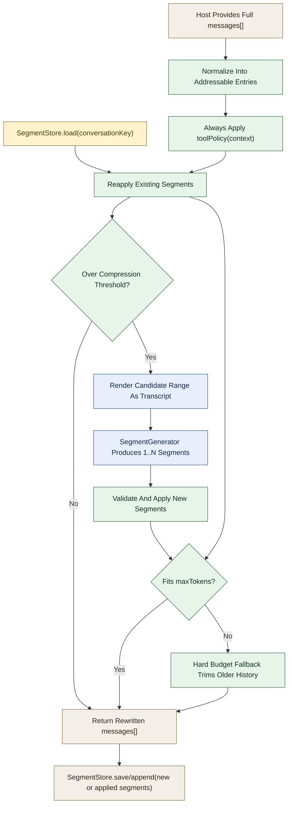

# ai-sdk-context-mgmt-middleware

Reusable context management for AI SDK apps and Tenex-class systems.

The package has two layers:
- a pure context engine that works on normalized transcript entries
- a thin AI SDK middleware adapter that rewrites the outgoing prompt and persists summary segments through a host-owned store

## Mental Model

Input on each turn:
- the full current `messages[]`
- any previously persisted compression segments for the conversation

Output on each turn:
- a rewritten `messages[]` array ready for the provider call
- any newly generated segments that the host should persist for the next turn

The full conversation remains the source of truth. The package does not own conversation storage.

## High-Level Flow



## What It Does

On each turn the engine:
1. normalizes the full `messages[]` array into addressable entries
2. always applies `toolPolicy(context)` to tool calls and tool results
3. reapplies any previously persisted summary segments
4. checks the token budget after those transforms
5. if still above the compression threshold, renders the newest unsummarized block before the protected tail into a transcript and asks an LLM for 1 or more replacement segments
6. applies those segments and returns the rewritten messages
7. enforces a final hard token budget fallback if the prompt is still too large

This keeps segment state outside the middleware. Hosts own persistence.

## Installation

```bash
npm install ai-sdk-context-mgmt-middleware
```

## Pure Engine

```ts
import {
  createSegmentGenerator,
  defaultToolPolicy,
  manageContext,
} from "ai-sdk-context-mgmt-middleware";

const segmentGenerator = createSegmentGenerator({
  async generate(prompt) {
    return await cheapModel(prompt);
  },
});

const result = await manageContext({
  messages: conversationEntries,
  maxTokens: 128_000,
  compressionThreshold: 0.8,
  protectedTailCount: 4,
  existingSegments: persistedSegments,
  segmentGenerator,
  toolPolicy: (context) => {
    const base = defaultToolPolicy(context);
    if (context.toolName === "important_data") {
      return {
        ...base,
        result: { policy: "keep" },
      };
    }
    return base;
  },
});

// result.messages: rewritten transcript entries
// result.appliedSegments: canonical segment set for persistence
// result.newSegments: only the segments created on this turn
```

## AI SDK Middleware

```ts
import { wrapLanguageModel } from "ai";
import { openai } from "@ai-sdk/openai";
import {
  createCompressionCache,
  createContextManagementMiddleware,
  createSegmentGenerator,
  defaultToolPolicy,
} from "ai-sdk-context-mgmt-middleware";

const segmentStore = new Map<string, any[]>();

const middleware = createContextManagementMiddleware({
  maxTokens: 128_000,
  compressionThreshold: 0.8,
  protectedTailCount: 4,
  cache: createCompressionCache({ maxEntries: 100 }),
  segmentStore: {
    load: (conversationKey) => segmentStore.get(conversationKey) ?? [],
    save: (conversationKey, segments) => {
      segmentStore.set(conversationKey, segments);
    },
  },
  resolveConversationKey({ params }) {
    return (params.providerOptions as any).contextManagement.conversationId;
  },
  segmentGenerator: createSegmentGenerator({
    async generate(prompt) {
      return await cheapModel(prompt);
    },
  }),
  toolPolicy: (context) => {
    const base = defaultToolPolicy(context);
    if (context.toolName === "logs") {
      return {
        ...base,
        result: { policy: "remove" },
      };
    }
    return base;
  },
});

const model = wrapLanguageModel({
  model: openai("gpt-4o"),
  middleware,
});
```

`createContextManagementMiddleware` is also exported as `contextManagement`.

## Tool Policy

`toolPolicy(context)` is always applied, even when the conversation is still below the segment-compression threshold.

The policy receives both sides of the exchange:
- `context.call`
- `context.result`
- `context.exchangePositionFromEnd`
- `context.combinedTokens`
- `context.currentTokenEstimate`
- `context.maxContextTokens`

This lets one policy account for tools whose token cost lives mostly in the call input (`fs_write`) as well as tools whose cost lives mostly in the result (`fs_read`).

The function returns per-entry decisions:

```ts
{
  call?: { policy: "keep" | "truncate" | "remove", maxTokens?: number },
  result?: { policy: "keep" | "truncate" | "remove", maxTokens?: number },
}
```

If you do not provide a policy, the package uses `defaultToolPolicy(context)`, which applies a depth-and-size heuristic to both tool calls and tool results.

### Tool Content Hook

Use `onToolContentTruncated(event)` to store removed or truncated tool content externally and optionally replace it with retrieval text:

```ts
onToolContentTruncated: async (event) => {
  const storageId = await ragStore.save(event.originalContent);
  return `[Tool content stored externally. Retrieve with rag_get("${storageId}")]`;
}
```

`event.entryType` tells you whether the change came from a tool call or a tool result.

## Transcript Rendering

`createTranscript(entries, options?)` renders normalized entries into a transcript string and returns:
- `text`
- `shortIdMap`
- `firstId`
- `lastId`

The built-in renderer emits an XML-like transcript because it works well for structured LLM compression, but the API is generic and accepts a custom `TranscriptRenderer`.

## Segment Generation

`SegmentGenerator` implementations receive:
- `transcript`
- `targetTokens`
- `messages`
- `previousSegments`

They return structured segments:

```ts
[{ fromId, toId, compressed }]
```

Use `createSegmentGenerator(...)` for a default JSON-based helper, or provide your own implementation.

## Segment Persistence

The middleware does not keep hidden conversation state.

If you want summary chunks to be reused on the next turn, provide a `SegmentStore` and a `resolveConversationKey(...)` function. The middleware will:
- `load(conversationKey)` before compression
- `save(conversationKey, appliedSegments)` or `append(conversationKey, newSegments)` after compression

Append-only stores are supported because the engine only creates new segments for the newest unsummarized block before the protected tail.

## Hard Budget Fallback

If tool policy plus segment compression still do not fit `maxTokens`, the engine drops older history until the prompt fits and inserts:

```txt
[Earlier conversation truncated to fit token budget]
```

This is a last-resort safety brake for provider calls.

## API

Primary exports:
- `manageContext(config)`
- `createContextManagementMiddleware(config)`
- `createTranscript(messages, options?)`
- `applySegments(messages, segments)`
- `validateSegments(messages, segments, options?)`
- `createSegmentGenerator(config)`
- `createCompressionCache(options?)`
- `createDefaultEstimator()`
- `defaultToolPolicy(context)`

Adapter helpers:
- `normalizeMessages(messages)`
- `promptToContextMessages(prompt)`
- `contextMessagesToPrompt(messages)`

## Notes

- Plain text entries get deterministic short IDs from `role + content`; duplicates are suffixed with `-2`, `-3`, etc.
- Tool-call and tool-result entries derive stable IDs from the AI SDK tool call ID.
- The package is text-first. Hosts should normalize multimodal content before compression if they need more control.

## License

MIT
